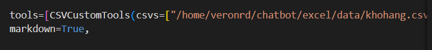
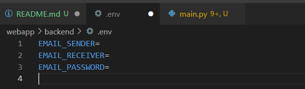

## AI Agent Basic Workflow
<b>Run Repo:</b>

Tải Ollama 

https://ollama.com/download/windows

Mở terminal: ollama pull gemma3:4b

```
cd webapp
cd frontend
npm install
npm run dev
cd ../backend
pip install -r requirements.txt
python main.py 
```

<b>Demo: </b>

<b>CSV Demo:</b>

Define path of csv in webapp/backend/CSVAgent.py file


Add .env file for mail receive and send:




<b>Leaf Disease Detection Demo:</b>


