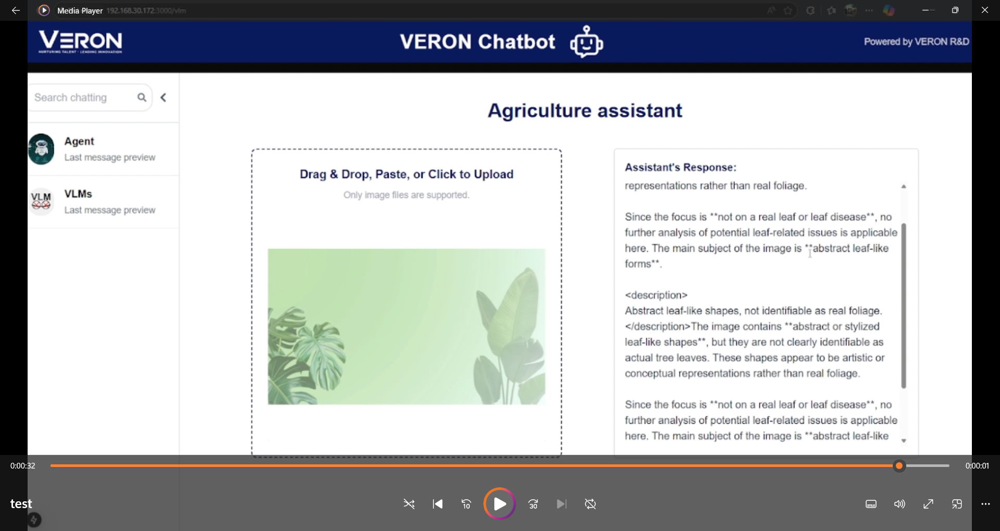

## AI Agent Basic Workflow
<b>Run Repo:</b>

Tải Ollama 

https://ollama.com/download/windows

Mở terminal: ollama pull gemma3:4b

```
cd webapp
cd frontend
npm install
npm run dev
cd ../backend
pip install -r requirements.txt
python main.py 
```


<b>CSV Agent Demo:</b>

Define path of csv in webapp/backend/CSVAgent.py file


Add .env file for mail receive and send:


<b>Leaf Disease Detection Demo:</b>

The agent first analyzes the image to determine whether the leaf shows signs of disease.


Then, it will search for the treatment for the leaf disease has been detected.


If the image is not focus on leaf or leaf disease, it will return the basic content of the figure/image 



Link full demo: https://drive.google.com/file/d/1PrkW8j83CAEd9E9gz3fDbCBovh6eSyyu/view?usp=sharing